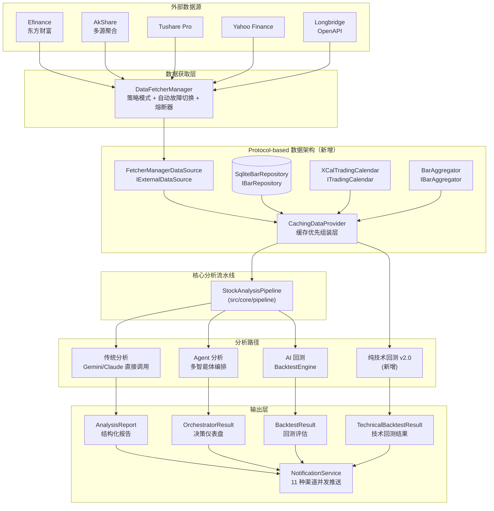
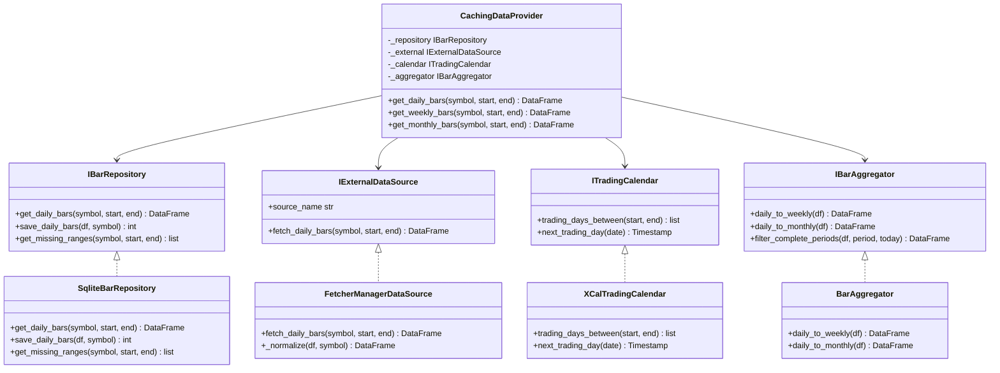
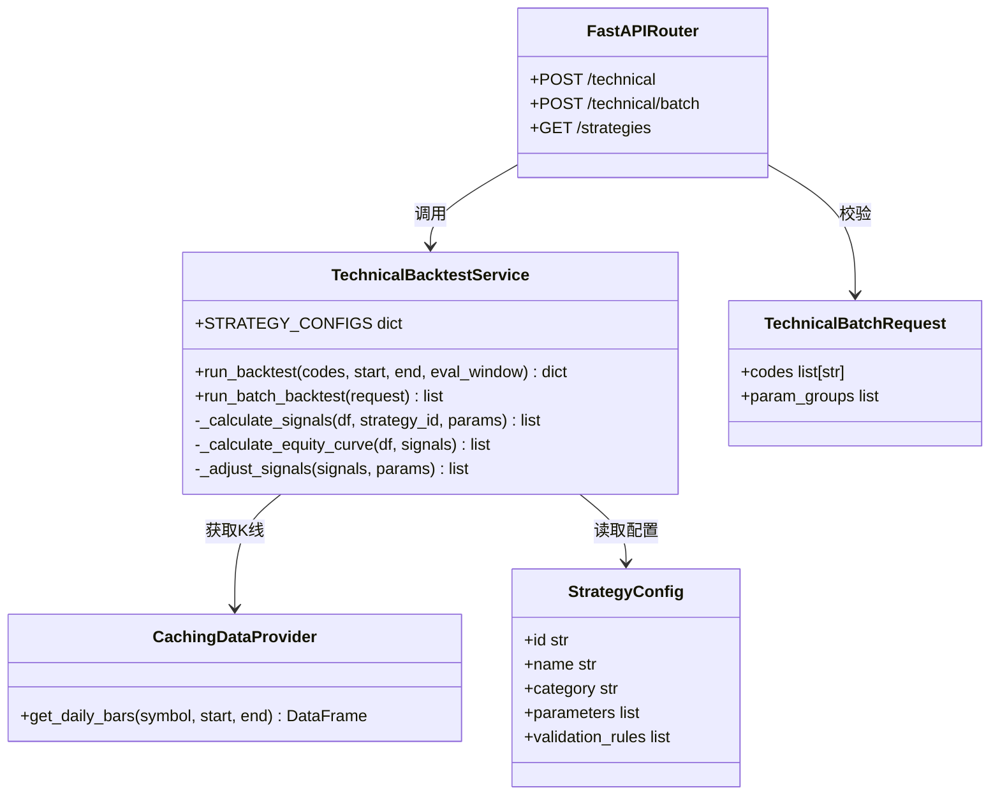
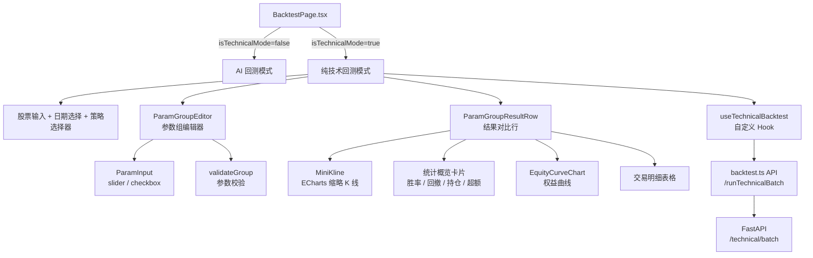

# DSA 项目架构分析

> 本文档描述 DSA（Daily Stock Analysis）股票智能分析系统的整体架构、模块关系和数据流。
> 更新时间：2026-05-08

---

## 1. 项目定位

**DSA** 是一个覆盖 A股、港股、美股的股票智能分析系统。

**核心流程**：

```
数据抓取 → 技术分析/新闻检索 → LLM 分析 → 生成报告 → 多渠道通知推送
```

**交付形态**：

- **命令行工具**：`python main.py` 直接运行分析
- **FastAPI 服务**：`python main.py --serve` 提供 REST API
- **Web 前端**：`apps/dsa-web/`（React 19 + Vite）
- **桌面端**：`apps/dsa-desktop/`（Electron + 打包 Python 后端）
- **定时任务**：GitHub Actions 每日自动运行
- **Docker 部署**：支持定时模式和 API 服务模式

---

## 2. 项目结构总览

```
daily_stock_analysis/
├── main.py                    # CLI 入口（分析、定时、完整流程）
├── server.py                  # FastAPI 服务入口
├── analyzer_service.py        # 多调用方统一的分析 API 封装
├── webui.py                   # Web UI 入口
│
├── src/                       # 后端核心源码
│   ├── core/                  # 主流程编排
│   ├── services/              # 业务服务层
│   ├── repositories/          # 数据访问层（Repository Pattern）
│   ├── schemas/               # Pydantic Schema
│   ├── agent/                 # 多智能体系统
│   ├── notification_sender/   # 通知发送器（11 种渠道）
│   ├── storage.py             # SQLite ORM / DatabaseManager
│   ├── config.py              # 全局配置（单例）
│   ├── auth.py                # 认证模块
│   └── enums.py               # 枚举类型
│
├── data_provider/             # 多数据源适配（Strategy Pattern）
│   ├── base.py                # Fetcher 基类 + 管理器 + 熔断器
│   ├── efinance_fetcher.py    # 东方财富（A股首选）
│   ├── akshare_fetcher.py     # AkShare（多子源聚合）
│   ├── tushare_fetcher.py     # Tushare Pro
│   ├── yfinance_fetcher.py    # Yahoo Finance（美股）
│   ├── longbridge_fetcher.py  # 长桥 OpenAPI（港股/美股）
│   ├── tickflow_fetcher.py    # 市场复盘专用
│   ├── fundamental_adapter.py # 基本面适配器
│   └── realtime_types.py      # 实时行情统一类型定义
│
├── api/                       # FastAPI API
│   ├── app.py                 # 应用工厂
│   └── v1/endpoints/          # 路由端点
│
├── apps/
│   ├── dsa-web/               # Web 前端（React 19 + Vite）
│   └── dsa-desktop/           # 桌面端（Electron + 打包 Python）
│
├── strategies/                # YAML 策略定义（12 种策略）
├── tests/                     # pytest 测试套件
├── scripts/                   # 本地脚本
├── docker/                    # Docker 构建
├── .github/workflows/         # GitHub Actions CI/CD
└── docs/                      # 文档
```

---

## 3. 数据流全景



---

## 4. 后端分层架构

### 4.1 Repository 层 — 数据访问抽象

采用 **Repository Pattern**，将数据库操作封装在标准接口后，业务逻辑依赖抽象接口，不依赖具体存储机制。

```
src/repositories/
├── stock_repo.py      # 股票数据 CRUD、分析上下文查询
├── analysis_repo.py   # 分析历史记录查询与保存
├── backtest_repo.py   # 回测候选获取、结果批量保存
└── portfolio_repo.py  # 持仓数据 CRUD
```

### 4.2 Service 层 — 业务逻辑

```
src/services/
├── analysis_service.py           # 封装分析逻辑，统一 CLI/Bot/API 入口
├── backtest_service.py           # AI 回测编排：批量获取候选 → 引擎评估 → 持久化
├── technical_backtest_service.py # 纯技术回测引擎（v1.0 硬编码规则 + v2.0 可配置策略）
├── portfolio_service.py          # 持仓账户、交易记录、现金流管理
├── history_service.py            # 历史数据服务
├── task_service.py               # 任务调度与管理
├── report_renderer.py            # 报告渲染（Markdown/HTML/图片）
└── image_stock_extractor.py      # 图片中的股票代码提取（LLM + 正则）
```

### 4.3 Core 层 — 流程编排

```
src/core/
├── pipeline.py           # 股票分析主流程调度器（1775行）
├── backtest_engine.py    # 回测引擎（纯逻辑，DB无关）
├── market_review.py      # 每日大盘复盘
├── market_analyzer.py    # 大盘分析器
├── market_strategy.py    # 区域化市场策略蓝图（CN/US/HK）
├── trading_calendar.py   # 多市场交易日历
└── config_manager.py     # 配置管理器
```

**`StockAnalysisPipeline`** 核心流程：

1. 检查断点续传（今日是否已分析）
2. 获取历史K线数据（`DataFetcherManager`）
3. 本地技术指标计算（MA/MACD/RSI）
4. 新闻情报搜索（多搜索引擎并发）
5. LLM 分析（传统直接调用 **或** Agent 流水线）
6. 生成结构化报告（Pydantic Schema 校验）
7. 保存结果到 SQLite
8. 发送通知（Markdown → 图片 → 多渠道并发推送）

---

## 5. 多数据源适配层

### 5.1 Fetcher 策略模式

**基类**：`data_provider/base.py` 中的 `BaseFetcher`

```python
class BaseFetcher(ABC):
    @abstractmethod
    def _fetch_raw_data(self, stock_code, start, end):
        """获取原始数据"""

    @abstractmethod
    def _normalize_data(self, raw_data):
        """标准化为标准列名：date, open, high, low, close, volume, amount, pct_chg"""
```

### 5.2 所有 Fetcher

| Fetcher | 文件 | 优先级 | 定位 |
|---------|------|--------|------|
| EfinanceFetcher | `efinance_fetcher.py` | 0 | A股首选（东方财富） |
| AkshareFetcher | `akshare_fetcher.py` | 1 | A股主数据源（多子源） |
| TushareFetcher | `tushare_fetcher.py` | 0/2 | 有Token时P0，否则P2 |
| PytdxFetcher | `pytdx_fetcher.py` | 2 | 通达信行情服务器 |
| BaostockFetcher | `baostock_fetcher.py` | 3 | 证券宝备用 |
| YfinanceFetcher | `yfinance_fetcher.py` | 4 | Yahoo Finance 兜底 |
| LongbridgeFetcher | `longbridge_fetcher.py` | 5 | 长桥OpenAPI（美股/港股） |
| TickFlowFetcher | `tickflow_fetcher.py` | 99 | 仅市场复盘 |

### 5.3 按市场路由

| 市场 | 数据源优先级 | 特殊处理 |
|------|-------------|---------|
| **A股** | Efinance → AkShare → Tushare → Pytdx → Baostock | 涨跌停规则：北交所30%、科创/创业板20%、ST股5%、普通10% |
| **港股** | Longbridge → AkShare(hk) | 代码格式：`HK00700` |
| **美股** | YFinance → Longbridge | 指数映射：`SPX` → `^GSPC`，`DJI` → `^DJI` |

### 5.4 Fallback 机制

1. **历史数据 Fallback**：按优先级遍历 Fetcher，单源失败自动切换下一源
2. **实时行情 Fallback**：主源成功但缺少量比/换手率等字段时，继续从后续源补充
3. **熔断器保护**：
   - 实时行情：连续3次失败 → 熔断5分钟
   - 筹码分布：连续2次失败 → 熔断10分钟
4. **防封禁**：随机休眠（1.5-5秒）、随机 User-Agent、tenacity 指数退避重试

### 5.5 实时行情统一类型

```python
# data_provider/realtime_types.py
@dataclass
class UnifiedRealtimeQuote:
    price: float          # 当前价
    change_pct: float     # 涨跌幅
    volume: int           # 成交量
    volume_ratio: float   # 量比
    turnover_rate: float  # 换手率
    pe_ratio: float       # PE
    pb_ratio: float       # PB
    # ... 30+ 个统一字段
```

### 5.6 Protocol-based 数据获取架构（新增）

在原有 `DataFetcherManager` 策略模式之上，新增一层基于 `typing.Protocol` 的依赖注入体系，实现数据访问的标准化、可测试化和存储无关化。

#### 5.6.1 核心 Protocol

```python
# src/data_provider/interfaces.py

@runtime_checkable
class ITradingCalendar(Protocol):
    def trading_days_between(self, start, end) -> list[pd.Timestamp]: ...
    def next_trading_day(self, date) -> pd.Timestamp | None: ...

@runtime_checkable
class IBarRepository(Protocol):
    def get_daily_bars(self, symbol, start, end) -> pd.DataFrame | None: ...
    def save_daily_bars(self, df, symbol) -> int: ...
    def get_missing_ranges(self, symbol, start, end) -> list[tuple]: ...

@runtime_checkable
class IExternalDataSource(Protocol):
    def fetch_daily_bars(self, symbol, start, end) -> pd.DataFrame | None: ...

@runtime_checkable
class IBarAggregator(Protocol):
    def daily_to_weekly(self, df) -> pd.DataFrame: ...
    def daily_to_monthly(self, df) -> pd.DataFrame: ...
```

#### 5.6.2 实现矩阵

| Protocol | 实现类 | 文件 | 职责 |
|----------|--------|------|------|
| `ITradingCalendar` | `XCalTradingCalendar` | `trading_calendar_adapter.py` | 基于 `exchange-calendars` 库，支持 CN/HK/US 三市场，fail-open 策略 |
| `IBarRepository` | `SqliteBarRepository` | `bar_repository.py` | SQLite + SQLAlchemy ORM，含 Daily/Weekly/Monthly 三表，UPSERT 语义 |
| `IExternalDataSource` | `FetcherManagerDataSource` | `external_data_source.py` | 适配现有 `DataFetcherManager`，列名标准化（`date` → `trade_date`） |
| `IBarAggregator` | `BarAggregator` | `bar_aggregator.py` | 日线 → 周线/月线聚合，groupby 策略避免空周期脏数据 |

#### 5.6.3 缓存优先组装层

```python
# src/data_provider/caching_provider.py
class CachingDataProvider:
    """组装 IBarRepository + IExternalDataSource + ITradingCalendar + IBarAggregator"""
    # 策略：先查磁盘 → 计算缺失区间 → 外部补全 → 自动保存 → 返回完整数据
```

**标准列名事实标准**：`symbol, trade_date, open, high, low, close, volume, amount, pre_close, change, pct_chg`

#### 5.6.4 架构价值

- **存储无关**：业务逻辑依赖 `IBarRepository` 接口，可无缝切换为 PostgreSQL/MongoDB
- **可测试**：单元测试可直接注入内存 DataFrame 或 mock 对象
- **渐进式改造**：`FetcherManagerDataSource` 作为适配器，兼容原有 `DataFetcherManager`，不破坏现有调用链路
- **类型安全**：`@runtime_checkable` + mypy 静态检查，接口契约显式化

#### 5.6.5 类图



---

## 6. 纯技术回测引擎

纯技术回测是与 AI 回测并行的独立回测体系，完全基于技术指标和量化规则，不依赖 LLM。前端以「技术回测」Tab 与「AI 回测」Tab 共存于 `/backtest` 页面。

### 6.1 双版本演进

| 维度 | v1.0 | v2.0（当前开发中） |
|------|------|------------------|
| 策略定义 | 后端硬编码信号规则（MA20 支撑、量能萎缩、量能突破、金叉死叉、RSI 超卖） | 后端 `STRATEGY_CONFIGS` 配置文件 + 前端参数组编辑器 |
| 参数配置 | 无 | 最多 6 组参数并行对比 |
| 权益曲线 | 无 | 含交易费用的权益曲线 + 基准对比 |
| 信号执行 | 当日收盘生成信号，次日开盘执行 | 同上 |
| 批量回测 | 无 | `run_batch_backtest`（当前 mock 阶段，基于随机扰动） |

### 6.2 v2.0 策略配置体系

```python
# src/services/technical_backtest_service.py
STRATEGY_CONFIGS = {
    "dual_ma": {
        "name": "双均线趋势跟踪",
        "category": "trend",
        "parameters": [
            {"key": "fast_period", "name": "快线周期", "type": "number", "default": 5, "min": 2, "max": 30},
            {"key": "slow_period", "name": "慢线周期", "type": "number", "default": 20, "min": 5, "max": 60},
        ],
        "validation_rules": [
            {"type": "lessThan", "paramA": "fast_period", "paramB": "slow_period", "message": "快线周期必须小于慢线周期"}
        ]
    },
    "macd": {...},
    "rsi": {...},
    "bollinger": {...},
}
```

### 6.3 权益曲线计算模型

```python
BUY_FEE_RATE = 0.0003   # 买入佣金 0.03%
SELL_FEE_RATE = 0.0013  # 卖出佣金 + 印花税 0.13%

# 买入时按可用资金计算可买股数（向下取整）
shares = int(cash / (buy_price * (1 + BUY_FEE_RATE)))
total_cost = shares * buy_price * (1 + BUY_FEE_RATE)

# 卖出时扣除卖出费用
sell_value = shares * sell_price * (1 - SELL_FEE_RATE)
```

**信号执行语义**：信号在当日收盘时生成，在下一交易日的开盘价执行。这一设计避免了未来函数（look-ahead bias）。

### 6.4 后端组件关系



### 6.5 API 端点

```
POST /api/v1/backtest/technical       # v1.0 单股技术回测
POST /api/v1/backtest/technical/batch # v2.0 批量参数组回测（单股，最多6组）
GET  /api/v1/backtest/strategies      # 获取策略配置列表
```

**Schema 约束**：`TechnicalBatchRequest` 使用精确 `Literal` 类型限制参数类型和校验规则类型：`type: Literal["number", "boolean"]`、`validation.type: Literal["lessThan", "greaterThan"]`、`codes` 长度限制 `min_length=1, max_length=1`（当前仅支持单股）。

---

## 7. LLM 集成架构

### 7.1 多 Provider 统一调用

通过 **LiteLLM** 统一调用：

| Provider | 配置变量 |
|---------|---------|
| Google Gemini | `GEMINI_API_KEY` |
| DeepSeek | `DEEPSEEK_API_KEY` |
| Anthropic Claude | `ANTHROPIC_API_KEY` |
| OpenAI | `OPENAI_API_KEY` |
| AIHubMix | `AIHUBMIX_KEY` |
| Ollama（本地） | `OLLAMA_BASE_URL` |

### 7.2 多模型 Fallback 链

主模型失败时自动尝试 fallback 模型链，直到成功或全部失败。

### 7.3 结构化输出

```python
# src/schemas/report_schema.py
class AnalysisReportSchema(BaseModel):
    core_conclusion: CoreConclusion      # 核心结论（信号/置信度/理由）
    data_perspective: DataPerspective    # 数据视角（趋势/价格/量能/筹码）
    intelligence: Intelligence           # 情报（新闻/风险/催化）
    battle_plan: BattlePlan              # 作战计划（狙击点/仓位/检查清单）
```

---

## 8. 多智能体系统（Agent System）

### 8.1 智能体类型

```
src/agent/agents/
├── base_agent.py        # Agent 抽象基类（LLM 调用、工具使用、上下文管理）
├── technical_agent.py   # 技术分析智能体（均线/MACD/RSI/形态）
├── intel_agent.py       # 情报搜集智能体（新闻/公告/资金流）
├── risk_agent.py        # 风险筛查智能体（减持/业绩/监管）
├── decision_agent.py    # 决策合成智能体（最终仪表盘，无工具）
└── portfolio_agent.py   # 持仓分析智能体
```

### 8.2 编排器模式

```
src/agent/orchestrator.py  # 多智能体流水线协调器
```

支持 4 种模式：

| 模式 | 流水线 | LLM 调用次数 |
|------|--------|-------------|
| `quick` | Technical → Decision | ~2 次 |
| `standard` | Technical → Intel → Decision | ~3 次（默认） |
| `full` | Technical → Intel → Risk → Decision | ~4 次 |
| `specialist` | Technical → Intel → Risk → Specialist → Decision | ~5 次 |

### 8.3 通信协议

```python
# src/agent/protocols.py
@dataclass
class AgentContext:
    query: str = ""
    stock_code: str = ""
    data: Dict[str, Any] = field(default_factory=dict)       # 共享数据
    opinions: List[AgentOpinion] = field(default_factory=list)  # 各智能体意见
    risk_flags: List[Dict] = field(default_factory=list)     # 风险标记

@dataclass
class AgentOpinion:
    agent_name: str
    signal: str           # strong_buy / buy / hold / sell / strong_sell
    confidence: float     # 0.0-1.0
    reasoning: str
    key_levels: Dict[str, float]
```

### 8.4 工具系统

```
src/agent/tools/
├── registry.py          # 工具注册表（OpenAI function calling schema）
├── data_tools.py        # 数据工具（行情/K线/筹码/基本面）
├── analysis_tools.py    # 分析工具（趋势/技术指标）
├── search_tools.py      # 搜索工具（新闻/多搜索引擎）
├── market_tools.py      # 市场工具（大盘/板块）
└── backtest_tools.py    # 回测工具
```

### 8.5 技能系统（YAML 驱动策略）

```
strategies/
├── bull_trend.yaml          # 默认多头趋势
├── ma_golden_cross.yaml     # 均线金叉
├── volume_breakout.yaml     # 放量突破
├── dragon_head.yaml         # 龙头策略
├── shrink_pullback.yaml     # 缩量回踩
├── bottom_volume.yaml       # 底部放量
├── one_yang_three_yin.yaml  # 一阳夹三阴
├── box_oscillation.yaml     # 箱体震荡
├── chan_theory.yaml         # 缠论
├── wave_theory.yaml         # 波浪理论
└── emotion_cycle.yaml       # 情绪周期
```

每个策略 YAML 包含：名称、分类、所需工具、适配的市场状态标签、自然语言策略说明。用户可自定义策略，无需编写代码。

---

## 9. 通知系统

### 9.1 架构

```python
# src/notification.py — 多继承聚合所有发送器
class NotificationService(
    AstrbotSender, CustomWebhookSender, DiscordSender,
    EmailSender, FeishuSender, PushoverSender,
    PushplusSender, Serverchan3Sender, SlackSender,
    TelegramSender, WechatSender
):
```

### 9.2 支持渠道

| 渠道 | 配置变量 |
|------|---------|
| 企业微信 | `WECHAT_WEBHOOK_URL` |
| 飞书 | `FEISHU_WEBHOOK_URL` |
| Telegram | `TELEGRAM_BOT_TOKEN`, `TELEGRAM_CHAT_ID` |
| 邮件 SMTP | `EMAIL_HOST`, `EMAIL_USER`, `EMAIL_PASSWORD` |
| Discord | `DISCORD_WEBHOOK_URL` |
| Slack | `SLACK_WEBHOOK_URL` |
| Pushover | `PUSHOVER_APP_TOKEN`, `PUSHOVER_USER_KEY` |
| PushPlus | `PUSHPLUS_TOKEN` |
| Server酱3 | `SERVERCHAN3_SENDKEY` |
| ASTRBOT | `ASTRBOT_WEBHOOK_URL` |
| 自定义 Webhook | `CUSTOM_WEBHOOK_URLS` |

**设计原则**：单渠道失败不拖垮整体，Markdown 报告先转图片再推送。

---

## 10. Web 前端架构（apps/dsa-web）

### 10.1 技术栈

| 类别 | 技术 | 版本 |
|------|------|------|
| 框架 | React | 19.2.0 |
| 构建 | Vite | ~6.0 |
| 语言 | TypeScript | ~5.7 |
| 路由 | react-router-dom | 7.13.0 |
| 状态管理 | Zustand + React Context | 5.0.11 |
| 样式 | Tailwind CSS | 4.1.18 |
| HTTP | Axios | 1.13.4 |
| 图表 | Recharts | 3.3.0 |
| 实时通信 | EventSource (SSE) + fetch stream | 原生 API |
| 测试 | Playwright | ~1.49 |

### 10.2 路由结构

| 路由 | 页面 | 功能 |
|------|------|------|
| `/` | `HomePage.tsx` | 股票分析仪表盘、历史记录、报告查看 |
| `/chat` | `ChatPage.tsx` | AI 多轮对话、技能选择、会话管理 |
| `/portfolio` | `PortfolioPage.tsx` | 持仓账户管理、交易记录、风险分析 |
| `/backtest` | `BacktestPage.tsx` | AI 回测 + 纯技术回测（双 Tab 模式） |
| `/settings` | `SettingsPage.tsx` | 系统配置、LLM 通道、认证设置 |
| `/login` | `LoginPage.tsx` | 登录/首次设置 |

### 10.3 状态管理

```
Zustand Store（高频业务状态）
├── stockPoolStore.ts    # 首页仪表盘状态（查询/历史/报告/任务）
├── agentChatStore.ts    # AI 对话状态（消息/会话/流式输出）
└── analysisStore.ts     # 分析任务状态

React Context（低频认证状态）
└── AuthContext.tsx      # 认证状态 + 自动初始化 + 路由守卫
```

### 10.4 纯技术回测 v2.0 组件体系

`BacktestPage.tsx` 采用**双模式 Tab 切换**设计：`isTechnicalMode=false` 时为 AI 回测，`isTechnicalMode=true` 时为纯技术回测。

#### 组件分层

```
BacktestPage.tsx（页面编排层）
├── AI 回测模式（原有）
│   ├── 代码筛选、日期范围、评估窗口
│   └── 结果表格 + 分页
└── 纯技术回测模式（v2.0 新增）
    ├── 股票自动补全、日期范围、策略选择器
    ├── ParamGroupEditor（参数组编辑器）
    │   ├── 最多 6 组参数并行配置
    │   ├── 参数校验（lessThan/greaterThan 规则）
    │   ├── 添加/删除/复制/启用/禁用
    │   └── slider + checkbox 输入控件
    ├── 执行按钮 → useTechnicalBacktest hook
    └── ParamGroupResultRow（结果对比行）× N
        ├── MiniKline（ECharts 缩略 K 线 + 买卖信号标记）
        ├── 统计概览（胜率/最大回撤/平均持仓/超额收益）
        ├── EquityCurveChart（ECharts 权益曲线，策略 vs 基准）
        └── 近期交易明细迷你表格
```

#### 自定义 Hook: `useTechnicalBacktest`

提取所有 v2.0 状态与逻辑，职责单一：

```typescript
function useTechnicalBacktest() {
  // 策略列表 + 当前选中策略
  const [strategies, setStrategies] = useState<StrategyConfig[]>([]);
  const [selectedStrategyId, setSelectedStrategyId] = useState<string>('');

  // 参数组管理（最多 6 组）
  const [paramGroups, setParamGroups] = useState<ParamGroup[]>([...]);
  const [invalidGroupIds, setInvalidGroupIds] = useState<Set<string>>(new Set());

  // 批量回测执行状态
  const [batchResults, setBatchResults] = useState<ParamGroupResult[]>([]);
  const [isBatchRunning, setIsBatchRunning] = useState(false);

  // 单股校验（当前仅支持单股回测）
  const handleRunBatch = async () => { ... };
}
```

#### 类型系统: `technicalBacktest.ts`

完整的 v2.0 类型分层：

```typescript
// 策略配置层
interface StrategyConfig { id, name, category, parameters[], validationRules[] }
interface StrategyParameter { key, name, type: 'number' | 'boolean', defaultValue, min?, max?, step? }

// 参数组层
interface ParamGroup { id, name, enabled, params: Record<string, number | boolean> }

// 回测结果层
interface ParamGroupResult {
  group: ParamGroup;
  stockResult: TechnicalBacktestStockResult;
  equityCurve: EquityCurvePoint[];
  trades: TradeRecord[];
}

// 可视化层
interface EquityCurvePoint { date, strategyValue, benchmarkValue }
interface TradeRecord { id, entryDate, entryPrice, exitDate, exitPrice, returnPct, pnlAmount, holdDays }
```

#### 前端组件关系图



### 10.5 实时通信

| 机制 | 场景 | 实现 |
|------|------|------|
| SSE | 任务实时状态流 | `EventSource` → `/api/v1/analysis/tasks/stream` |
| fetch stream | AI 对话流式输出 | 原生 `fetch` + `ReadableStream` + `AbortController` |
| 轮询 | 历史记录刷新 | `setInterval(30000ms)` + `visibilitychange` 事件 |

### 10.6 认证流程

1. `AuthContext` 挂载时自动请求 `GET /api/v1/auth/status`
2. `setupState === 'no_password'` → 首次设置密码
3. `setupState === 'password_retained'` → 登录
4. 基于 **HTTP-only Cookie**，前端不存储 Token
5. 任何 401 → 自动跳转 `/login?redirect=当前路径`

---

## 11. 桌面端架构（apps/dsa-desktop）

### 11.1 核心定位

Electron 包装器 + 打包 Python 后端，不是"纯前端包装"：

```
Electron main.js 启动
    ↓
显示 loading.html（加载动画）
    ↓
动态寻找可用端口（8000-8100）
    ↓
spawn Python 后端（PyInstaller 可执行文件 / python main.py）
    ↓
轮询 /api/health 直到就绪（最多60秒）
    ↓
加载 Web UI（http://127.0.0.1:{port}/）
    ↓
Web UI 由 FastAPI 的 static 文件处理器服务
```

### 11.2 桌面专属能力

| 能力 | 实现 |
|------|------|
| 自动启动后端 | Electron 进程管理（spawn/monitor/kill） |
| 版本更新检查 | GitHub Releases API 比对 |
| 配置备份/恢复 | `/api/system-config/desktop-export`（`DSA_DESKTOP_MODE` 限制） |
| 本地数据 | `.env` + `data/stock_analysis.db` + `logs/` 都在可执行文件旁 |
| 主题感知 | `nativeTheme` 适配暗色/亮色 |

### 11.3 与 Web 版对比

| 维度 | Web | Desktop |
|------|-----|---------|
| 后端 | 需手动启动 | 自动 spawn |
| 数据库 | 服务器端 | 本地 SQLite |
| 配置 | 环境变量 | 本地 `.env` 文件 |
| 更新 | 服务器部署 | GitHub Release 检查 |
| 端口 | Vite 5173 | FastAPI 8000-8100 |

---

## 12. CI/CD 与部署

### 12.1 CI 流水线

| Job | 触发条件 | 说明 | 阻断 |
|-----|---------|------|------|
| `ai-governance` | 所有 PR | 校验 AGENTS.md / CLAUDE.md / Copilot 指令 | 是 |
| `backend-gate` | 所有 PR | `./scripts/ci_gate.sh`：语法 → Flake8 → 测试 | 是 |
| `docker-build` | 所有 PR | Docker 构建 + 关键模块导入 smoke | 是 |
| `web-gate` | Web 改动时 | `npm run lint && npm run build` | 是 |

### 12.2 发布流程

```
commit message 含 #patch/#minor/#major
    ↓
auto-tag.yml → 自动 bump 版本号
    ↓
push annotated tag vX.Y.Z
    ↓
create-release.yml → 创建 GitHub Release
docker-publish.yml → 推送多架构镜像（linux/amd64, linux/arm64）
desktop-release.yml → Windows .exe + macOS .dmg
```

### 12.3 每日定时任务

- **调度**：工作日 UTC 10:00（北京时间 18:00）
- **随机延迟**：0-60 秒（防并发冲突）
- **超时**：30 分钟
- **产物**：`reports/` + `logs/` 作为 artifact 保留 30 天

### 12.4 Docker 部署

```yaml
# docker/docker-compose.yml
services:
  analyzer:  # 定时任务模式
    command: python main.py --schedule
  server:    # API 服务模式
    command: python main.py --serve-only
    ports: ["8000:8000"]
```

多阶段构建：Stage 1（Node）构建 Web UI → Stage 2（Python 3.11 slim）运行后端。

---

## 13. 关键设计模式

| 模式 | 应用位置 | 价值 |
|------|---------|------|
| **Repository Pattern** | `src/repositories/` | 数据访问抽象，便于测试和切换存储 |
| **Strategy Pattern** | `data_provider/` | 多数据源 + 自动故障切换 |
| **Protocol / Duck Typing** | `src/data_provider/interfaces.py` | 存储无关的依赖注入，渐进式改造 |
| **Circuit Breaker** | `data_provider/realtime_types.py` | 防止连续失败时反复请求，自动恢复 |
| **Multi-Agent Orchestration** | `src/agent/orchestrator.py` | 专业智能体流水线，支持 4 种模式 |
| **YAML-Driven Skills** | `strategies/` | 用户可自定义策略，无需编写代码 |
| **Fail-Open** | `data_provider/fundamental_adapter.py` | 基本面数据允许部分返回，不拖垮整体 |
| **Layered Architecture** | `src/` 三层 | Repository → Service → Core，职责清晰 |
| **MVC/MVVM（前端）** | `apps/dsa-web/` | Pages → Components → Hooks → Stores 分层 |
| **Compound Components** | `ParamGroupEditor` | 父组件管状态，子组件通过 Props 消费，避免 Prop Drilling |

---

## 14. 技术债务与注意事项

1. **`run_batch_backtest` 为 mock 阶段**：当前基于 `_adjust_signals` 随机扰动生成模拟结果，尚未接入真实策略执行引擎
2. **前端 `index.css` 过大**：约 2900 行 CSS，建议拆分为按功能域的 CSS 模块
3. **桌面端 `main.js` 过长**：约 1040 行，可考虑按功能拆分为模块
4. **`pipeline.py` 过长**：1775 行，是核心调度器但已接近维护边界
5. **单测覆盖率**：测试文件数量多但需关注覆盖率是否达到目标
6. **Bundle 体积**：Vite 构建产物 JS 约 1.2MB（gzip 后 394KB），可考虑代码分割优化

---

*本文档由架构探索自动生成，后续迭代中如有模块新增或架构调整，请及时更新。*
