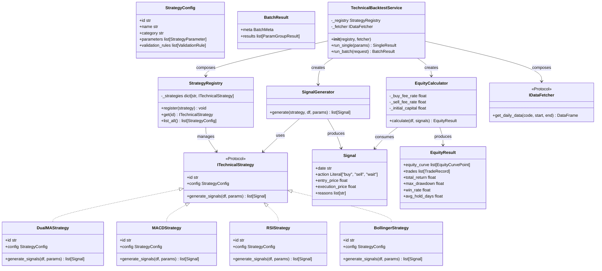
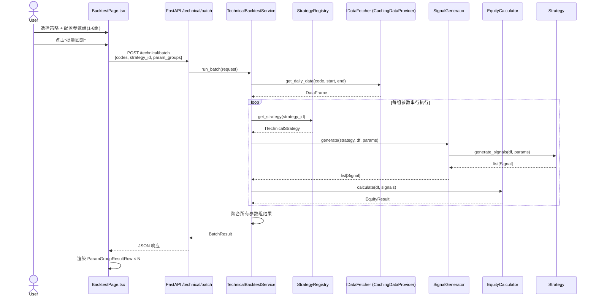
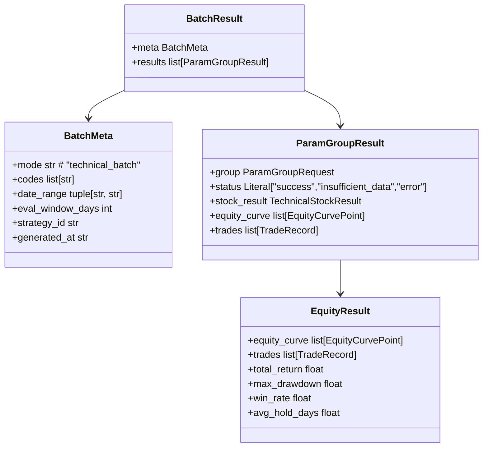
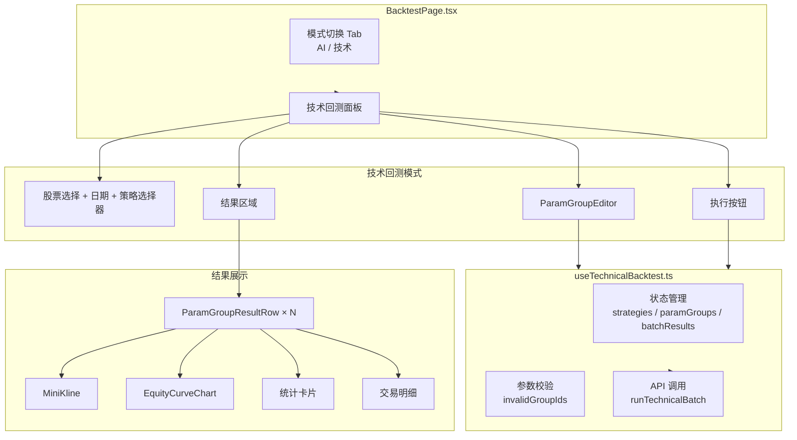
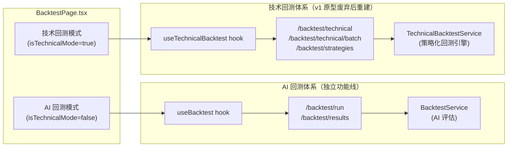
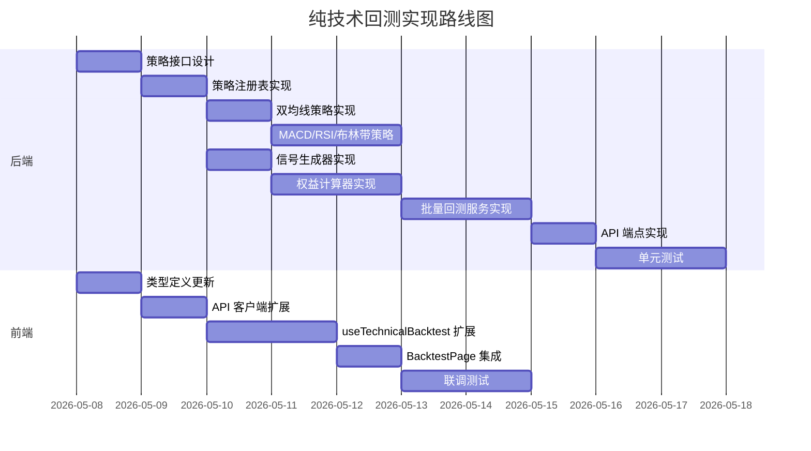

# 纯技术回测架构设计

> 本文档基于 `docs/architecture.md` 的架构分析，定义「纯技术回测」正式实现的完整架构设计。
> 状态：Round5 自检完成（Round4 评审的 5 项条件 + 6 项 P1/P2 问题已全部修复）
> 创建时间：2026-05-08

---

## 1. 设计目标与约束

### 1.1 版本定位

**v1 原型阶段**：前端已实现 K 线图渲染、参数组编辑器界面、结果对比布局，验证了产品方向正确。但后端回测引擎是空的——`run_backtest` 中的 6 条硬编码规则是探索性质代码，`_adjust_signals` 明确标注为 **mock 阶段**（随机扰动生成假结果）。v1 的后端代码不属于正式实现。

**本次开发**：不是「v1 的增强升级」，而是**废弃 v1 的后端原型代码，从零重新实现真实的回测引擎**。前端界面成果直接复用。

### 1.2 目标

| 目标 | 说明 |
|------|------|
| G1 | 废弃 v1 硬编码原型，重建可配置策略体系，支持参数化定义 |
| G2 | 实现批量参数组回测（单股、最多 6 组参数对比） |
| G3 | 后端真实计算权益曲线（含交易费用）与基准对比，替代前端 mock |
| G4 | 前端复用 v1 界面成果（参数组编辑器、结果对比布局），接入真实后端 |
| G5 | 与 AI 回测功能完全隔离，互不破坏 |

### 1.3 约束

| 约束 | 来源 | 影响 |
|------|------|------|
| C1 | `window.KlineChart` 全局单例不可变更 | AI 回测的 K 线渲染不受影响 |
| C2 | `window.echarts` 全局用于缩略 K 线和权益曲线 | 需管理实例生命周期（dispose） |
| C3 | 当前仅支持单股回测 | `codes` 长度限制 `max_length=1` |
| C4 | 信号执行语义：收盘生成信号，次日开盘执行 | 避免未来函数，不可更改 |
| C5 | 交易费用模型：买入 0.03%，卖出 0.13%（含印花税） | 已验证，保持不变 |
| C6 | 后端策略配置通过 Python 常量定义 | 演进路径：后续支持 JSON 配置 + 热重载 |
| C7 | React 18 + Tailwind v4 + CSS custom properties | 前端技术栈不变 |
| C8 | FastAPI + Pydantic Literal 严格类型 | Schema 约束不可放宽 |

---

## 2. 后端策略引擎架构设计

### 2.1 核心设计决策

**决策 D1：Strategy Interface + 注册表模式**

每个可配置策略实现统一的 `ITechnicalStrategy` Protocol，通过策略注册表动态发现。策略配置（参数定义、校验规则）与策略执行逻辑分离。

**决策 D2：信号生成与权益计算解耦**

信号生成（`SignalGenerator`）仅负责基于 K 线数据和参数产出买卖信号。权益计算（`EquityCalculator`）负责基于信号序列模拟交易、计算费用、生成权益曲线。两者通过不可变的信号列表通信。

**决策 D3：批量回测串行执行**

单股多参数组的批量回测在当前阶段采用串行执行（非并行）。原因：
- 单股数据量小（通常 < 5000 条日线），串行执行足够快
- 避免并行带来的内存竞争和调试复杂度
- 为后续升级为多进程/异步并行保留扩展点

**性能基线**：单股 6 组参数串行执行 < 3 秒（含数据获取）。
**扩展点**：当需要支持 20+ 组参数时，可改为 `asyncio.gather` 或进程池并行执行。

### 2.2 v1 原型废弃与重建策略

当前 `src/services/technical_backtest_service.py` 中的代码属于**v1 原型阶段产物**，不是正式实现：

- `run_backtest` 中的 6 条硬编码规则是探索性质代码，不可配置、不可扩展
- `run_batch_backtest` 中的 `_adjust_signals` 明确标注为 **mock 阶段**（随机扰动生成假结果）
- 权益计算 `_calculate_equity_curve` 虽已实现，但与信号生成紧耦合，无法独立复用

**本设计对 v1 原型的处理方式——废弃重建**：

| v1 原型代码 | 处置方式 | 说明 |
|------------|---------|------|
| `run_backtest` 硬编码规则 | **废弃** | 不是提取为 `LegacyStrategy`，而是直接删除。可配置策略体系重新实现 |
| `_adjust_signals` mock 逻辑 | **废弃** | 替换为 `SignalGenerator` 基于参数的真实计算 |
| `_calculate_equity_curve` | **参考复用** | 费用模型和交易执行逻辑参考保留，提取到独立的 `EquityCalculator` |
| `STRATEGY_CONFIGS` 字典 | **重建** | 升级为 `StrategyRegistry` + `ITechnicalStrategy` Protocol 体系 |

**重建路径**：
1. 新建 `src/services/backtest/` 目录，按以下结构实现：
   ```
   src/services/backtest/
     __init__.py
     strategies/              # 策略实现
       __init__.py
       base.py                # ITechnicalStrategy Protocol + Signal
       registry.py            # StrategyRegistry
       dual_ma.py             # 双均线策略
       macd.py                # MACD策略
       rsi.py                 # RSI策略
       bollinger.py           # 布林带策略
     engine/                  # 计算引擎
       __init__.py
       signal_generator.py    # SignalGenerator
       equity_calculator.py   # EquityCalculator
     service.py               # TechnicalBacktestService（统一入口）
   ```
2. 前端复用 v1 界面成果，API 接入新引擎
3. 新引擎验证通过后，删除 `technical_backtest_service.py` 中原型方法（`run_backtest`、`_adjust_signals` 等），最终移除该文件

### 2.3 类结构设计

> **以下类图为 V2 目标架构设计。当前代码中这些类尚未实现，将在 `src/services/backtest/` 目录下从零构建。**



### 2.4 信号生成接口契约

```text
class ITechnicalStrategy(Protocol):
    """技术指标策略接口"""

    @property
    def id(self) -> str: ...

    @property
    def config(self) -> StrategyConfig: ...

    @property
    def min_warmup_bars(self) -> int: ...

    @property
    def required_columns(self) -> set[str]: ...

    def validate_params(self, params: dict[str, Any]) -> list[str]: ...

    def generate_signals(
        self,
        df: pd.DataFrame,           # 标准 OHLCV DataFrame
        params: dict[str, Any],     # 参数组字典
    ) -> list[Signal]: ...
```

**Signal 数据结构**（不可变，最简设计）— **V2 内部数据结构，非 API Schema**：

```text
@dataclass(frozen=True)
class Signal:
    date: str                      # 信号生成日期（YYYY-MM-DD）
    action: Literal["buy", "sell", "wait"]
    entry_price: Optional[float]   # 参考价格（收盘价）
    execution_price: Optional[float]  # 参考执行价（策略可填收盘价作为参考，EquityCalculator 优先使用；为 None 时由 EquityCalculator 查次日开盘价）
    reasons: List[str]             # 触发理由列表
```

**与 V1 Schema 的区别**：
- `Signal` 是 V2 回测引擎的**内部数据结构**，不直接暴露给 API
- V1 的 `TechnicalSignalItem`（含 `stop_loss`/`take_profit`/`confidence`）用于 `/technical` 端点，V2 保留该 Schema 以兼容 V1 API
- V2 批量回测端点（`/technical/batch`）返回 `TechnicalStockResult`，其 `signals` 字段在需要时可通过适配层转换

**SignalGenerator 接口定义**（可从类图推断，此处显式定义）：

```text
class SignalGenerator:
    """信号生成器

    职责：代理调用策略生成信号，可附加预热数据检查。
    不直接暴露给外部，由 TechnicalBacktestService 内部创建和使用。
    """

    def generate(
        self,
        strategy: ITechnicalStrategy,  # 策略实例
        df: pd.DataFrame,              # 标准 OHLCV DataFrame
        params: dict[str, Any],        # 参数组字典
    ) -> list[Signal]:
        """
        执行流程：
        1. 校验 df 列是否包含 strategy.required_columns
        2. 校验 df 长度 >= strategy.min_warmup_bars
        3. 调用 strategy.generate_signals(df, params)
        4. 返回信号列表（不做过滤或修改）
        """
        ...
```

**设计说明**：
- 无 v1 兼容负担，`Signal` 只保留正式引擎必需的字段
- `execution_price` 由策略根据执行语义填入，使 `EquityCalculator` 无需依赖 `df` 列结构
- `stop_loss`/`take_profit`/`confidence` 已删除——权益计算按次日开盘执行，不触发止损止盈；批量回测对比维度是收益率曲线而非信号置信度

### 2.5 权益计算核心逻辑

```text
@dataclass(frozen=True)
class EquityResult:
    equity_curve: list[EquityCurvePoint]
    trades: list[TradeRecord]
    total_return: float
    max_drawdown: float
    win_rate: float
    avg_hold_days: float        # 平均持仓天数

**EquityResult → TechnicalStockResult 字段映射**：

| EquityResult | TechnicalStockResult | 说明 |
|-------------|---------------------|------|
| `total_return` | `avg_return` | 总收益率 |
| `max_drawdown` | `max_drawdown` | 最大回撤 |
| `win_rate` | `win_rate` | 胜率 |
| `avg_hold_days` | — | 平均持仓天数（TechnicalStockResult 暂无对应字段，可扩展） |
| `equity_curve` | — | 单独作为 `ParamGroupResult.equity_curve` 返回 |
| `trades` | — | 单独作为 `ParamGroupResult.trades` 返回 |

class EquityCalculator:
    """权益计算器

    **有意识取舍**：当前费用模型按市场（cn/hk/us）统一费率，不区分板块（科创板/北交所等）
    或券商差异。当前仅 A 股主板的费率为精确值（买入 0.03%、卖出 0.13% 含印花税），
    港股/美股为占位值。精确费用模型可后续扩展。
    """
    FEE_RATES = {
        "cn": {"buy": 0.0003, "sell": 0.0013},  # A股
        "hk": {"buy": 0.0003, "sell": 0.0013},  # 港股（占位，需校准）
        "us": {"buy": 0.0003, "sell": 0.0003},  # 美股（占位，需校准）
    }
    INITIAL_CAPITAL = 100_000

    def __init__(
        self,
        market: Literal["cn", "hk", "us"] = "cn",
        calendar: TradingCalendar,  # 交易日历，用于查找下一交易日
        slippage_model: Optional[SlippageModel] = None,  # 预留滑点模型扩展点
    ):
        rates = self.FEE_RATES.get(market, self.FEE_RATES["cn"])
        self._buy_fee_rate = rates["buy"]
        self._sell_fee_rate = rates["sell"]
        self._calendar = calendar
        self._slippage_model = slippage_model

    def calculate(self, df: pd.DataFrame, signals: list[Signal]) -> EquityResult:
        """
        执行语义：
        1. 信号在 date 日收盘时生成
        2. 在 date 的**下一交易日**开盘价执行（通过 TradingCalendar 查找，非简单日期+1）
        3. 买入时按可用资金计算股数（向下取整）
        4. 卖出时扣除卖出费用

        df 参数用途：
        - 基准曲线计算：按回测起始日收盘价买入并持有，逐日计算市值
          （基准曲线数据通过 `EquityCurvePoint.benchmark_value` 逐点返回）
        - 最后一日强制平仓：回测结束日若仍有持仓，按当日收盘价平仓
        - execution_price 回填：当 Signal.execution_price 为 None 时，从 df 中查次日开盘价

        仓位管理策略（单次持仓 one-position-at-a-time）：
        - 已有持仓时收到 buy 信号：忽略（不加仓）
        - 已有持仓时收到 sell 信号：平仓（按执行价卖出全部持仓）
        - 无持仓时收到 sell 信号：忽略（不空仓）
        - 同日内多个信号：仅处理第一个有效信号（买入优先于卖出仅在无持仓时）

        强制平仓：
        - 回测结束日（df 最后一条记录日期）若仍有持仓，按当日收盘价强制平仓
        - 强制平仓产生的交易计入 trades，reason 标注为 "force_close"

        基准曲线（买入并持有）：
        - 回测起始日按收盘价买入，持有至结束日
        - 期间不复权、不分红再投资
        - 每日 benchmark_value = 初始资金 × (当日收盘价 / 起始日收盘价)
        """

class TradingCalendar(Protocol):
    """交易日历接口，屏蔽不同市场的节假日差异"""
    def next_trading_day(self, date: pd.Timestamp) -> pd.Timestamp: ...  # 返回下一交易日
    def is_trading_day(self, date: pd.Timestamp) -> bool: ...
```

**依赖注入规范**：

`TechnicalBacktestService` 必须在 `__init__` 中显式接收所有依赖，**禁止**使用 `or DatabaseManager.get_instance()` 等单例 fallback 模式：

```python
# 正确做法 — 显式注入
def __init__(
    self,
    registry: StrategyRegistry,
    fetcher: IDataFetcher,
):
    self._registry = registry
    self._fetcher = fetcher

# 错误做法 — 单例穿透（禁止）
def __init__(self, registry=None, fetcher=None):
    self._registry = registry or StrategyRegistry.get_instance()  # 禁止
    self._fetcher = fetcher or DatabaseManager.get_instance()     # 禁止
```

**原因**：显式注入使服务可独立测试、可替换实现（如 mock fetcher）、支持多数据库配置。

### 2.6 策略配置数据结构

策略配置定义策略的可调参数和校验规则，由后端硬编码（首批），后续演进为 JSON 配置 + 热重载。

```python
@dataclass(frozen=True)
class StrategyParameter:
    """策略参数定义

    **有意识取舍**：当前阶段仅支持 `number`/`boolean` 类型。首批 4 个策略（双均线、MACD、RSI、
    布林带）均只需数值参数和布尔开关，足够覆盖。后续可扩展为支持 `enum`/`string` 类型。
    """
    key: str                           # 参数标识（英文，如 "short_period"）
    name: str                          # 显示名（中文，如 "短期均线周期"）
    type: Literal["number", "boolean"] # 参数类型
    default_value: Union[int, float, bool]  # 默认值
    min: Optional[Union[int, float]] = None   # 最小值（仅数值型）
    max: Optional[Union[int, float]] = None   # 最大值（仅数值型）
    step: Optional[Union[int, float]] = None  # 步长（前端滑动条用）

@dataclass(frozen=True)
class ValidationRule:
    """参数间校验规则

    **有意识取舍**：当前阶段仅支持 `lessThan`/`greaterThan` 两种基础规则，覆盖当前所有跨参数
    校验需求（如 short_period < long_period）。复杂交叉校验（如 A+B < C）可后续扩展。

    **V1/V2 命名差异**：V2 批量回测端点使用 camelCase（`lessThan`/`greaterThan`）。
    现有 V1 `/technical` 端点若使用 snake_case（`less_than`/`greater_than`），两者不冲突——
    V2 是新建端点，Schema 独立，不影响 V1 调用。
    """
    type: Literal["lessThan", "greaterThan"]  # 规则类型（V2 使用 camelCase）
    param_a: str                       # 参数 A（如 short_period）
    param_b: str                       # 参数 B（如 long_period）
    message: str                       # 校验失败提示（如 "短期周期必须小于长期周期"）

@dataclass(frozen=True)
class StrategyConfig:
    """策略配置（元数据）"""
    id: str                            # 策略标识（如 "dual_ma"）
    name: str                          # 显示名（如 "双均线策略"）
    description: str                   # 策略描述（用于前端展示）
    category: Literal["trend", "oscillator", "volatility", "volume"]
    parameters: list[StrategyParameter]
    validation_rules: list[ValidationRule]
```

**示例：双均线策略配置**

```python
DUAL_MA_CONFIG = StrategyConfig(
    id="dual_ma",
    name="双均线策略",
    category="trend",
    parameters=[
        StrategyParameter(
            key="short_period",
            name="短期均线周期",
            type="number",
            default_value=5,
            min=2,
            max=60,
            step=1,
        ),
        StrategyParameter(
            key="long_period",
            name="长期均线周期",
            type="number",
            default_value=20,
            min=5,
            max=250,
            step=1,
        ),
    ],
    validation_rules=[
        ValidationRule(
            type="lessThan",
            param_a="short_period",
            param_b="long_period",
            message="短期周期必须小于长期周期",
        ),
    ],
)
```

### 2.7 权益曲线与交易记录数据结构

```python
@dataclass(frozen=True)
class EquityCurvePoint:
    """权益曲线单点（仅用于图表渲染）"""
    date: str                          # 日期 YYYY-MM-DD
    strategy_value: float              # 策略当日权益（含交易费用）
    benchmark_value: float             # 基准当日权益（买入并持有）

@dataclass(frozen=True)
class TradeRecord:
    """单笔交易记录"""
    id: int                            # 交易序号
    entry_date: str                    # 买入日期
    entry_price: float                 # 买入价
    exit_date: str                     # 卖出日期
    exit_price: float                  # 卖出价
    return_pct: float                  # 盈亏百分比
    pnl_amount: float                  # 盈亏金额（已扣费用）
    hold_days: int                     # 持仓天数
    reason: str                        # 触发理由
```

### 2.8 策略注册表初始化

**有意识取舍**：当前采用硬编码注册（手动导入策略类并注册）。策略数量 <10 个时，
硬编码更简单、类型安全、IDE 友好。策略数量超过 10 个时建议引入自动发现机制
（目录扫描 + 动态导入）。

策略注册表在应用启动时初始化，支持**自动发现**和**手动注册**两种模式：

```python
# 方式一：自动发现（推荐）
# strategies/__init__.py 中导入所有策略，注册表自动收集
from .dual_ma import DualMAStrategy
from .macd import MACDStrategy
from .rsi import RSIStrategy
from .bollinger import BollingerStrategy

# 方式二：手动注册
registry = StrategyRegistry()
registry.register(DualMAStrategy())
registry.register(MACDStrategy())
```

**首批策略清单**：

| 策略 ID | 名称 | 类别 | 核心参数 |
|---------|------|------|----------|
| `dual_ma` | 双均线策略 | trend | `short_period`, `long_period` |
| `macd` | MACD 策略 | trend | `fast`, `slow`, `signal` |
| `rsi` | RSI 策略 | oscillator | `period`, `overbought`, `oversold` |
| `bollinger` | 布林带策略 | volatility | `period`, `std_dev` |

### 2.9 DataFrame 列结构约定

策略接收的 DataFrame 必须是**标准化 OHLCV 格式**：

| 列名 | 类型 | 说明 |
|------|------|------|
| `date` | str / datetime | 交易日期（索引或列） |
| `open` | float | 开盘价 |
| `high` | float | 最高价 |
| `low` | float | 最低价 |
| `close` | float | 收盘价 |
| `volume` | int / float | 成交量 |

**约定**：
- DataFrame 按 `date` 升序排列
- 数据已复权（前复权），策略无需处理除权除息
- `IDataFetcher.get_daily_data()` 负责返回符合上述格式的 DataFrame

---

## 3. 批量回测引擎设计

### 3.1 执行流程



### 3.2 结果聚合结构



**类型名对应关系**：
- `BatchResult` 是架构文档中的逻辑名称，对应 Schema 的 `TechnicalBatchResponse`。前端 API 层提取 `results` 字段传入 Hook。
- 前端 `ParamGroupResult.group` 的类型为 `ParamGroup`（含前端运行时状态 `enabled`），Schema 中对应 `ParamGroupRequest`（后端不需要 `enabled`）。两者字段结构一致，仅类型名差异。
- 前端 `stockResult` 的类型为 `TechnicalBacktestStockResult`，Schema 中对应 `TechnicalStockResult`。两者字段结构一致（`toCamelCase` 转换），`TechnicalBacktestStockResult` 是 V1 遗留命名，未与 Schema 统一。
- V2 批量回测返回的 `stock_result` 中，`rules`/`signals`/`evaluations` 字段为空列表（V2 不产出这些字段，保留仅用于兼容 V1 Schema 结构）。

**`TechnicalBacktestService.run_batch` 返回类型定义**：

```text
def run_batch(self, request: TechnicalBatchRequest) -> BatchResult:
    """
    批量回测主入口。对 request.codes[0] 单股，按 request.param_groups 串行执行每组参数回测。

    返回 BatchResult 结构：
    - meta: BatchMeta      # 批次元数据（模式、代码、日期范围、策略ID、生成时间）
    - results: list[ParamGroupResult]  # 每组参数的执行结果，顺序与 request.param_groups 一致

    ParamGroupResult 结构：
    - group: ParamGroupRequest         # 原始参数组（含参数值和名称）
    - status: Literal["success","insufficient_data","error"]
    - stock_result: TechnicalStockResult  # 汇总指标（total_return/win_rate/max_drawdown 等）
    - equity_curve: list[EquityCurvePoint]  # 权益曲线（含 benchmark_value 基准值）
    - trades: list[TradeRecord]        # 交易记录

    错误状态处理：
    - status="insufficient_data": K线数据不足（如 warmup bars 不够），stock_result 返回空对象，equity_curve/trades 返回空列表
    - status="error": 执行异常，stock_result 返回空对象，equity_curve/trades 返回空列表
    """
```

### 3.3 错误处理策略

| 场景 | 策略 | 说明 |
|------|------|------|
| 策略不存在 | 200 + meta.error | 返回所有参数组的 error 结果，meta.error 携带策略不存在信息 |
| 参数校验失败 | 400 + 详细错误 | 返回具体失败的参数组和规则 |
| K 线数据不足 | 200 + 部分结果 | 该参数组标记为 `insufficient_data` |
| 单组执行异常 | 200 + 部分结果 | 异常组标记为 `error`，其他组正常返回 |
| 全部失败 | 500 | 记录详细异常日志 |

### 3.4 错误响应格式

**参数校验失败（400）** — 当前端点返回简单错误结构：

```json
{
  "detail": {
    "error": "invalid_params",
    "message": "参数校验失败: short_period 必须小于 long_period"
  }
}
```

> **说明**：当前阶段采用 FastAPI 默认的 `HTTPException` 错误格式。详细的按参数组错误结构可在后续迭代中扩展。

**部分成功（200，含异常组）**：

```json
{
  "meta": { ... },
  "results": [
    {
      "group": { "id": "uuid-1", ... },
      "status": "success",
      "stock_result": { ... },
      "equity_curve": [ ... ],
      "trades": [ ... ]
    },
    {
      "group": { "id": "uuid-2", ... },
      "status": "insufficient_data",
      "stock_result": { ... },
      "equity_curve": [],
      "trades": []
    }
  ]
}
```

**策略不存在（200 + meta.error）**：

```json
{
  "meta": {
    "mode": "technical_batch",
    "codes": ["000001"],
    "date_range": "2024-01-01~2024-12-31",
    "eval_window_days": 10,
    "strategy_id": "unknown_strategy",
    "generated_at": "2026-05-09T00:00:00Z",
    "error": "策略未找到: unknown_strategy"
  },
  "results": [
    {
      "group": { "id": "uuid-1", "name": "参数组 1", "params": {} },
      "status": "error",
      "error_message": "策略未找到: unknown_strategy",
      "equity_curve": [],
      "trades": []
    }
  ]
}
```

---

## 4. 前端状态管理扩展设计

### 4.1 组件关系



### 4.2 状态分层

```typescript
// 策略配置层（只读，来自后端）
interface StrategyConfig {
  id: string;
  name: string;
  category: 'trend' | 'oscillator' | 'volatility' | 'volume';
  parameters: StrategyParameter[];
  validationRules: ValidationRule[];
}

// 参数组层（用户可编辑）
interface ParamGroup {
  id: string;           // crypto.randomUUID()
  name: string;
  enabled: boolean;
  params: Record<string, number | boolean>;
}

// 回测结果层（后端返回）
interface BatchResult {
  meta: BatchMeta;
  results: ParamGroupResult[];
}

// 前端运行时状态
interface TechnicalBacktestState {
  // 策略配置
  strategies: StrategyConfig[];
  selectedStrategyId: string;

  // 参数组
  paramGroups: ParamGroup[];
  invalidGroupIds: Set<string>;

  // 执行状态
  isBatchRunning: boolean;
  batchResults: ParamGroupResult[];
  technicalError: ParsedApiError | null;
}
```

### 4.3 策略切换时的参数组行为

当用户在参数组编辑器中切换策略时，不同策略的参数定义不兼容，必须重置参数组。当前实现策略：

| 场景 | 行为 |
|------|------|
| 切换策略 | 清空现有参数组，初始化一个默认参数组（策略的默认参数值） |
| 参数组状态 | 重置为单个参数组 `['参数组 1']`，名称和参数值均取自新策略的默认配置 |
| 回测结果 | 清空 `batchResults`，避免旧策略结果与新策略混淆 |

**原因**：不同策略的参数键完全不同（如双均线的 `short_period`/`long_period` 与 RSI 的 `period`/`overbought`/`oversold`），保留参数值无意义；重置为单个参数组简化实现，用户可重新添加需要的数量。

### 4.4 与现有状态管理的边界

- `useTechnicalBacktest` 完全独立于 Zustand Store，是一个局部 Hook
- AI 回测状态（`isLoading`, `results`, `pagination`）与技术回测状态互不干扰
- 模式切换（`isTechnicalMode`）由 `BacktestPage` 本地状态管理
- 股票代码输入框在两种模式下共享，但各自维护独立的校验逻辑

### 4.5 结果持久化策略（短期）

> **已实现**：`useTechnicalBacktest` Hook 中将回测结果同步写入 `sessionStorage`，页面刷新后自动恢复。

首批实现不将回测结果写入数据库（即时计算），但为避免页面刷新导致结果丢失，`useTechnicalBacktest` 应在 `batchResults` 变化时同步写入 `sessionStorage`：

```typescript
// 写入
sessionStorage.setItem('technical_backtest_last_result', JSON.stringify(batchResults));

// 恢复（hook 初始化时）
const saved = sessionStorage.getItem('technical_backtest_last_result');
if (saved) setBatchResults(JSON.parse(saved));
```

**边界**：
- 仅缓存最近一次结果，不缓存历史
- 切换股票代码或策略时清除缓存
- SessionStorage 在标签页关闭后自动清除

### 4.6 useTechnicalBacktest Hook 完整签名

```typescript
interface UseTechnicalBacktestOptions {
  technicalCodes: string;        // 股票代码输入（逗号分隔，当前仅支持单股）
  technicalStartDate: string;    // 回测开始日期 YYYY-MM-DD
  technicalEndDate: string;      // 回测结束日期 YYYY-MM-DD
  technicalEvalDays: string;     // 评估窗口天数（字符串，Hook 内转 int）
}

function useTechnicalBacktest(
  options: UseTechnicalBacktestOptions,
): {
  // === 策略配置层（只读，组件挂载时加载） ===
  strategies: StrategyConfig[];           // 可用策略列表（从 /strategies 获取）
  selectedStrategyId: string;             // 当前选中策略 ID
  setSelectedStrategyId: (id: string) => void;
  selectedStrategy: StrategyConfig | undefined;  // 当前选中的策略配置（计算属性）
  strategyError: ParsedApiError | null;   // 策略列表加载错误

  // === 参数组层（用户可编辑） ===
  paramGroups: ParamGroup[];              // 参数组列表
  invalidGroupIds: Set<string>;           // 校验失败的参数组 ID
  addParamGroup: () => void;             // 添加新参数组（最多 6 个）
  removeParamGroup: (id: string) => void;     // 删除指定参数组
  duplicateParamGroup: (id: string) => void;  // 复制指定参数组
  updateParamValue: (groupId: string, key: string, value: number | boolean) => void;
  updateGroupName: (groupId: string, name: string) => void;
  toggleGroupEnabled: (groupId: string) => void;
  setInvalidGroupIds: (ids: Set<string>) => void;

  // === 回测结果层（后端返回） ===
  batchResults: ParamGroupResult[] | null;

  // === 执行状态 ===
  isBatchRunning: boolean;
  technicalError: ParsedApiError | null;
  setTechnicalError: (err: ParsedApiError | null) => void;

  // === 操作 ===
  handleRunBatch: () => Promise<void>;   // 执行批量回测（无参，从 options + state 组装请求）
};
```

**使用示例**：

```typescript
const {
  strategies,
  selectedStrategyId,
  paramGroups,
  batchResults,
  isBatchRunning,
  handleRunBatch,
  addParamGroup,
  removeParamGroup,
} = useTechnicalBacktest({
  technicalCodes: '600519',
  technicalStartDate: '2024-01-01',
  technicalEndDate: '2024-12-31',
  technicalEvalDays: '10',
});

// 执行回测
const handleRun = async () => {
  await handleRunBatch();  // 无参，内部从 options + state 组装请求
};
```

---

## 5. 数据流与 API 契约

### 5.1 请求/响应契约

**API 文件组织**：技术回测端点拆分到独立的 router 文件，避免与 AI 回测端点混合：

```
api/v1/endpoints/
  backtest.py              # AI 回测端点（/run, /results, /performance）
  technical_backtest.py    # 技术回测端点（/technical, /technical/batch, /strategies）
```

**请求：批量回测**

```typescript
POST /api/v1/backtest/technical/batch

interface TechnicalBatchRequest {
  codes: string[];                    // min_length=1, max_length=1
  start_date?: string;                // YYYY-MM-DD
  end_date?: string;                  // YYYY-MM-DD
  eval_window_days?: number;          // 默认 10
  strategy_id: string;                // 策略标识
  param_groups: ParamGroupRequest[];  // min_length=1, max_length=6
}

interface ParamGroupRequest {
  id: string;
  name: string;
  params: Record<string, number | boolean>;
}
```

**响应：批量回测结果** — 与 Schema `TechnicalBatchResponse` 一致（扁平结构）

```typescript
interface TechnicalBatchResponse {
  meta: BatchMeta;
  results: ParamGroupResult[];
}
```

> **成功响应**：当前端点直接返回 Schema 定义的扁平结构 `{meta, results}`，不包装 `{success, data}` 外层。与 AI 回测 API 的统一格式可后续迭代。
>
> **错误响应**：采用 FastAPI 默认的 `HTTPException` 格式 `{"detail": {"error": "...", "message": "..."}}`，见 3.4 节。

### 5.2 数据转换层

后端使用 `snake_case`，前端使用 `camelCase`。转换由 `backtest.ts` 中的 `toCamelCase` 工具统一处理：

```text
// apps/dsa-web/src/api/backtest.ts
const toCamelCase = (obj: unknown): unknown => { ... };

// 请求时：camelCase → snake_case（axios 自动处理）
// 响应时：snake_case → camelCase（toCamelCase 递归转换）
```

**关键字段映射**：

| 后端 (snake_case) | 前端 (camelCase) | 说明 |
|-------------------|------------------|------|
| `group_id` | `groupId` | 参数组唯一标识 |
| `equity_curve` | `equityCurve` | 权益曲线点列表 |
| `total_return` | `totalReturn` | 总收益率 |
| `max_drawdown` | `maxDrawdown` | 最大回撤 |
| `win_rate` | `winRate` | 胜率 |
| `hold_days` | `holdDays` | 持仓天数 |

### 5.3 数据获取层选型

> **已实现**：端点通过 `get_v2_backtest_service()` 构造完整 DI 链（`DatabaseManager` → `SqliteBarRepository` → `CachingDataProvider` → `CachingDataProviderAdapter` → `V2BacktestService`），使用 `run_batch()` 执行批量参数组回测。

技术回测的数据获取层复用 AI 回测已有的 `CachingDataProvider`（缓存优先策略）：

```python
# 推荐实现
from data_provider.caching_provider import CachingDataProvider

fetcher = CachingDataProvider()  # 若数据已缓存则避免重复获取
service = TechnicalBacktestService(registry=registry, fetcher=fetcher)
```

**原因**：
- `CachingDataProvider` 已支持多数据源 fallback、字段标准化、缓存策略
- 复用避免重复实现数据获取逻辑
- 若数据未缓存，自动降级到实时获取

**适配器模式**：`CachingDataProvider` 的方法签名（`get_daily_bars`）与 `IDataFetcher` Protocol（`get_daily_data`）不一致，需通过适配器桥接：

```python
# src/services/backtest/engine/data_adapter.py
import pandas as pd
from data_provider.caching_provider import CachingDataProvider

class CachingDataProviderAdapter:
    """将 CachingDataProvider 适配为 IDataFetcher Protocol"""

    def __init__(self, provider: CachingDataProvider):
        self._provider = provider

    def get_daily_data(self, code: str, start: str, end: str) -> pd.DataFrame:
        """符合 IDataFetcher 接口的数据获取方法"""
        df = self._provider.get_daily_bars(
            symbol=code,
            start_date=pd.Timestamp(start),
            end_date=pd.Timestamp(end),
        )
        if df is None:
            raise InsufficientDataError(f"无 {code} 的 K 线数据")
        # 列名标准化：trade_date -> date，其余转为小写
        df = df.rename(columns=lambda c: c.lower().strip())
        if "trade_date" in df.columns:
            df = df.rename(columns={"trade_date": "date"})
        # 确保按 date 升序排列（策略计算依赖此约定）
        df = df.sort_values("date").reset_index(drop=True)
        return df
```

**使用方式**：

```python
from src.services.backtest.engine.data_adapter import CachingDataProviderAdapter
from data_provider.caching_provider import CachingDataProvider

fetcher = CachingDataProviderAdapter(CachingDataProvider())
service = TechnicalBacktestService(registry=registry, fetcher=fetcher)
```

**接口要求**（`IDataFetcher` Protocol）：

```python
class IDataFetcher(Protocol):
    """数据获取接口

    **实现说明**：本 Protocol 未声明异常，调用方应通过 try-except 处理数据获取失败。
    典型异常：`InsufficientDataError`（K线数据不足）、数据源连接异常等。
    具体异常类型由实现方决定，调用方按异常语义处理即可。
    """
    def get_daily_data(
        self,
        code: str,
        start: str,
        end: str,
    ) -> pd.DataFrame: ...
```

### 5.4 FastAPI 端点实现

> **已实现**：`api/v1/endpoints/technical_backtest.py` 中 `get_v2_backtest_service()` 构造完整 DI 链，端点使用 `service.run_batch()` 方法（v2.0 引擎）。

> **实现策略**：首批实现可为同步端点（`def`），后续按需优化为 `async def` + `asyncio.to_thread`。原因：
> - 当前批量回测为串行执行，单次请求计算量可控
> - 同步端点避免 pandas DataFrame 在线程间共享的潜在问题
> - 计算逻辑已提取为纯函数（`service.run_batch`），后续改为 `asyncio.to_thread` 无侵入

**异常类定义位置**：`src/services/backtest/exceptions.py`

```python
# src/services/backtest/exceptions.py
class StrategyNotFoundError(ValueError):
    """策略不存在"""
    pass

class InsufficientDataError(ValueError):
    """K线数据不足"""
    pass

class ParamValidationError(ValueError):
    """参数校验失败"""
    def __init__(self, group_id: str, errors: list[dict]):
        self.group_id = group_id
        self.errors = errors
```

```python
from fastapi import APIRouter, HTTPException

router = APIRouter(prefix="/backtest")

@router.get("/strategies")
def list_strategies():
    """获取所有可用策略配置"""
    registry = get_strategy_registry()  # 依赖注入获取
    # 返回 StrategyConfigItem 列表（与 Schema StrategyListResponse 一致）
    return [s.config for s in registry.list_all()]

@router.post("/technical/batch")
def run_technical_batch(request: TechnicalBatchRequest):
    """批量技术回测（首批同步实现，后续可按需改为 async + asyncio.to_thread）"""
    # 功能开关检查
    if not settings.TECHNICAL_BACKTEST_ENABLED:
        raise HTTPException(status_code=503, detail="技术回测功能已禁用")

    service = get_backtest_service()  # 依赖注入获取

    try:
        result = service.run_batch(request)
        # run_batch 内部处理策略不存在（200 + meta.error）和数据不足（200 + 部分结果），
        # 仅参数校验失败和未预期异常才会 raise 到端点层
        return result
    except ValueError as e:
        # **有意识取舍**：ParamValidationError 继承自 ValueError，此处统一捕获。
        # 当前阶段仅返回 str(e) 的简要错误信息，ParamValidationError 的 group_id/errors
        # 详情会丢失。如需前端展示具体哪个参数组的哪个参数出错，可在此处扩展为
        # 分别捕获 ParamValidationError 并返回结构化错误详情。
        raise HTTPException(status_code=400, detail=str(e))
    except Exception as e:
        logger.exception("批量回测失败")
        raise HTTPException(status_code=500, detail="回测执行失败")
**依赖注入工厂**（避免全局单例）：

```python
def get_strategy_registry() -> StrategyRegistry:
    """每次请求获取注册表实例（可缓存为单例，但非全局单例模式）

    **实现说明**：当前使用函数属性 `_instance` 缓存。FastAPI 多 worker 为多进程模式，
    每个进程独立初始化一次注册表是正常行为。策略注册表初始化后是只读的，不存在竞态条件。
    如需更严谨的初始化模式，可改为模块级变量或 `functools.lru_cache`。
    """
    if not hasattr(get_strategy_registry, "_instance"):
        registry = StrategyRegistry()
        # 自动注册所有策略
        from src.services.backtest.strategies import (
            DualMAStrategy, MACDStrategy, RSIStrategy, BollingerStrategy
        )
        registry.register(DualMAStrategy())
        registry.register(MACDStrategy())
        registry.register(RSIStrategy())
        registry.register(BollingerStrategy())
        get_strategy_registry._instance = registry
    return get_strategy_registry._instance

def get_backtest_service() -> TechnicalBacktestService:
    """每次请求创建服务实例

    **有意识取舍**：本函数使用 `DatabaseManager.get_instance()` 单例获取数据库连接。
    这与 2.5 节"禁止单例 fallback"的规范存在矛盾，但属于**过渡方案**：
    - 与现有代码库（`backtest.py` 中 `TechnicalBacktestService()` 无参构造）保持一致，降低迁移成本
    - V2 引擎稳定后，应改为 FastAPI `Depends` 注入或显式传递数据库配置
    - 策略注册表（StrategyRegistry）仍通过工厂函数获取，服务实例每次请求新建
    """
    registry = get_strategy_registry()

    # 构造 CachingDataProvider（参考现有服务的初始化方式）
    # 以下导入基于现有数据层架构，具体模块路径以实际代码为准
    from src.trading_calendar import XCalTradingCalendar
    from src.data_provider.sqlite_bar_repository import SqliteBarRepository
    from src.data_provider.fetcher_manager_source import FetcherManagerDataSource
    from src.data_provider.data_fetcher_manager import DataFetcherManager
    from src.data_provider.caching_provider import CachingDataProvider
    from src.services.backtest.engine.data_adapter import CachingDataProviderAdapter

    calendar = XCalTradingCalendar(market="cn")
    db = DatabaseManager.get_instance()
    bar_repo = SqliteBarRepository(db_manager=db, calendar=calendar)
    ext_source = FetcherManagerDataSource(DataFetcherManager())
    provider = CachingDataProvider(
        repository=bar_repo,
        external_source=ext_source,
        calendar=calendar,
    )
    fetcher = CachingDataProviderAdapter(provider)
    return TechnicalBacktestService(registry=registry, fetcher=fetcher)
```

---

## 6. 与 AI 回测的隔离策略

**重要区分**：本文档中的「技术回测」与「AI 回测」是两个独立的功能线。技术回测废弃自身 v1 原型后重建；AI 回测不受影响。

### 6.1 隔离边界



### 6.2 共享资源管理

| 资源 | AI 回测 | 技术回测 | 隔离策略 |
|------|---------|----------|----------|
| `window.KlineChart` | 主 K 线图表 | 不使用 | 技术回测使用 `window.echarts` |
| `window.echarts` | 不使用 | 缩略 K 线 + 权益曲线 | 独立实例，严格 dispose 管理（见下） |
| 股票代码输入 | 共享组件 | 共享组件 | 各自校验 |
| 日期范围选择 | 共享组件 | 共享组件 | 独立状态 |
| API 基础路径 | `/api/v1/backtest/*` | `/api/v1/backtest/*` | 不同端点 |

**ECharts 实例生命周期规范**：

每个使用 `window.echarts.init` 的组件必须遵守以下契约：

```typescript
// 组件内部
const chartRef = useRef<echarts.ECharts | null>(null);

useEffect(() => {
  if (!chartDomRef.current) return;

  // 1. 初始化
  chartRef.current = window.echarts.init(chartDomRef.current);

  // 2. 设置配置
  chartRef.current.setOption(option);

  // 3. 响应式
  const handleResize = () => chartRef.current?.resize();
  window.addEventListener('resize', handleResize);

  return () => {
    // 4. 清理：必须 dispose
    window.removeEventListener('resize', handleResize);
    chartRef.current?.dispose();
    chartRef.current = null;
  };
}, []);
```

**强制要求**：
- 每个 `init()` 必须有对应的 `dispose()`
- `dispose()` 必须在 `useEffect` cleanup 中调用
- dispose 后必须将引用置空（`chartRef.current = null`），防止重复 dispose
- 组件卸载、切换策略、重新渲染图表前，必须先 dispose 旧实例

### 6.3 AI 回测无破坏原则

技术回测的重建不影响 AI 回测：

1. **AI 回测端点不变**：`/run`, `/results`, `/performance` 行为不受影响
2. **AI Schema 不修改**：技术回测的 Schema 在独立命名空间，不与 AI 回测 Schema 冲突
3. **前端路由不变**：`/backtest` 页面通过 Tab 切换，不新增路由
4. **数据库不触碰**：核心引擎即时计算不写入 AI 回测表；P3 阶段新增独立的 `backtest_param_templates` 表
5. **全局状态隔离**：技术回测状态封装在 `useTechnicalBacktest` 中，不污染 AI 回测的 Zustand Store

---

## 7. 实现路线图

### 7.1 阶段划分



### 7.2 优先级排序

| 优先级 | 任务 | 说明 |
|--------|------|------|
| P0 | `ITechnicalStrategy` Protocol 定义 | 所有后续工作的基础 |
| P0 | `StrategyRegistry` 实现 | 策略发现机制 |
| P0 | `SignalGenerator` + `EquityCalculator` | 核心计算引擎 |
| P1 | `DualMAStrategy` 实现 | 首个可配置策略 |
| P1 | `/technical/batch` 端点 | 前端联调入口 |
| P2 | MACD / RSI / Bollinger 策略 | 扩展策略库 |
| P2 | 前端结果渲染优化 | 大数据量下的图表性能 |
| P3 🔄 | 回测结果持久化 | 保存历史回测记录到数据库（进行中） |
| P3 🔄 | 参数组模板保存 | 用户可保存常用参数配置（进行中） |

### 7.3 回滚策略

| 场景 | 回滚方式 |
|------|----------|
| 后端 API 异常 | 技术回测端点可独立禁用，不影响 AI 回测端点 |
| 前端渲染异常 | `isTechnicalMode` 切换回 AI 模式即可隔离 |
| 策略计算错误 | 策略注册表支持动态卸载，错误策略不影响其他策略 |
| 性能问题 | 批量回测改为单组执行，减少并发负载 |
| 功能开关 | 通过 `TECHNICAL_BACKTEST_ENABLED` 配置项控制是否启用 |

**功能开关**：建议在 `.env` / `config.py` 中添加配置项：

```python
TECHNICAL_BACKTEST_ENABLED = os.getenv("TECHNICAL_BACKTEST_ENABLED", "true").lower() == "true"
```

启用时注册技术回测端点，禁用时返回 503 Service Unavailable，进一步降低回滚风险。

---

## 8. 设计评审检查清单

在实现开始前，以下检查项需全部通过：

- [ ] 策略接口 `ITechnicalStrategy` 是否足够通用，支持未来新增策略类型？
- [ ] `Signal` 不可变设计是否满足信号传递的线程安全要求？
- [ ] `StrategyConfig` / `StrategyParameter` / `ValidationRule` 字段定义是否完整？
- [ ] `EquityCurvePoint` / `TradeRecord` 字段定义是否完整？
- [ ] 权益计算的费用模型是否与原型阶段保持一致？
- [ ] 批量回测的串行执行策略是否满足性能预期（单股 6 组 < 3 秒）？
- [ ] 前端 `useTechnicalBacktest` 的状态边界是否清晰，不会泄漏到 AI 回测模式？
- [ ] `useTechnicalBacktest` Hook 签名是否完整（返回值、参数）？
- [ ] `window.echarts` 实例的 dispose 逻辑是否完善，无内存泄漏？
- [ ] API Schema 的 `Literal` 类型约束是否足够严格，防止非法参数传入？
- [ ] 错误响应 JSON 格式是否覆盖所有异常场景？
- [ ] FastAPI 端点是否采用同步实现（首批）或 async + `asyncio.to_thread`（后续优化）？
- [ ] 与 AI 回测的隔离策略是否完整，有无共享状态的潜在冲突？
- [ ] `TechnicalBacktestService` 是否采用显式依赖注入，无单例穿透？
- [ ] `EquityCalculator` 是否通过 `TradingCalendar` 正确查找下一交易日？
- [ ] DataFrame 列结构约定是否明确（OHLCV 格式）？
- [ ] 数据获取层是否复用 `CachingDataProvider`（而非重复实现）？
- [ ] 策略注册表初始化方式是否明确（自动发现/手动注册）？
- [ ] 回滚策略是否覆盖了主要风险场景？
- [ ] 所有图表是否使用 mermaid UML 格式？

---

*本文档为架构设计文档，描述"系统应如何构建"。实现细节应在编码阶段通过 TDD 流程细化。*
